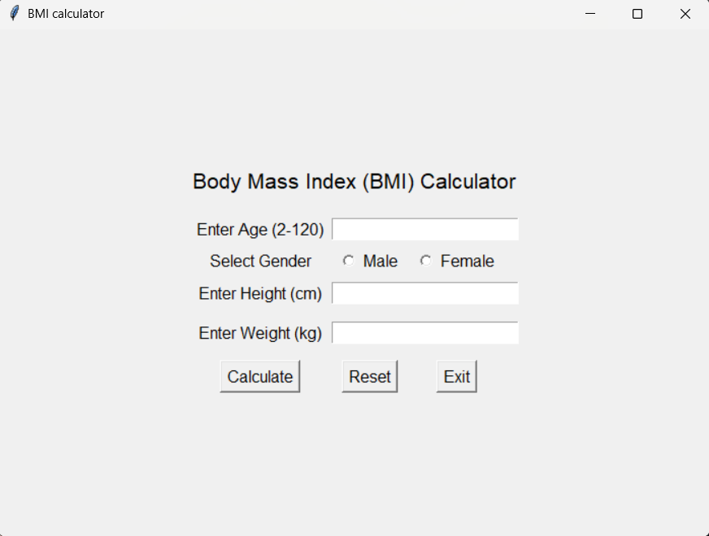

# BMI Calculator (Tkinter)
A simple Python GUI application that calculates Body Mass Index (BMI)
for both adults and children. This project was developed as part of a school programming assignment to practice Python, Tkinter, and basic input validation.

## Project preview

## Features
- Tkinter-based GUI
- Adult and child BMI calculation
- Age and gender-based classification
- Input validation
- Educational child BMI estimation
  

## Try this out yourself
1. Download `bmi_calculator.py` from this repository, make sure you have Python installed.
2. Launch the App and enter your details to see the calculator in action.
3. Use the Reset button to quickly clear the form for a new entry.

